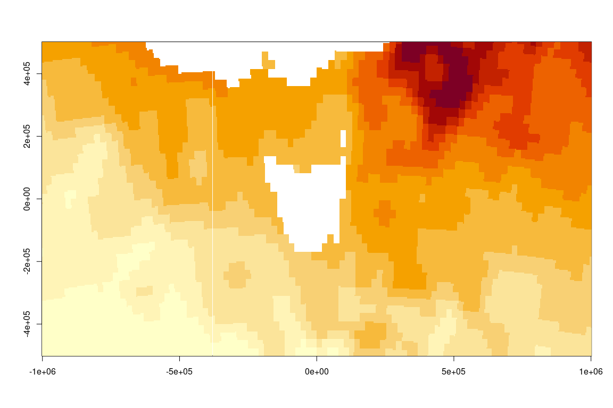
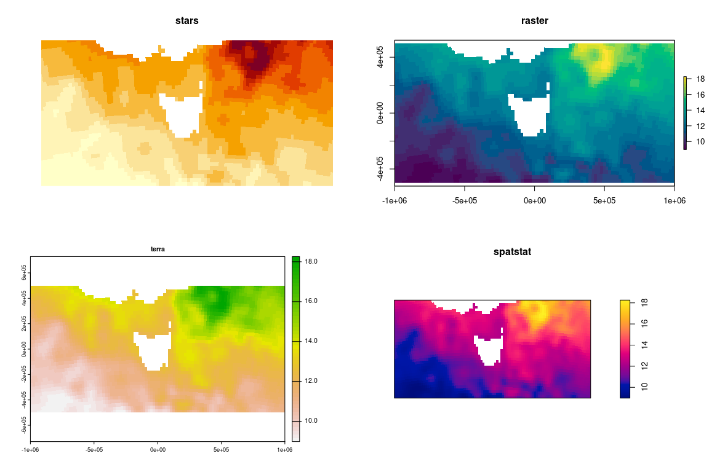
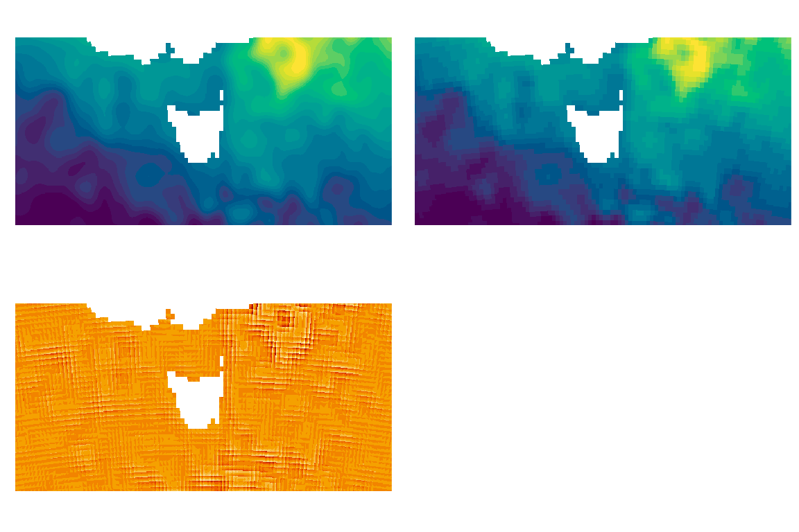
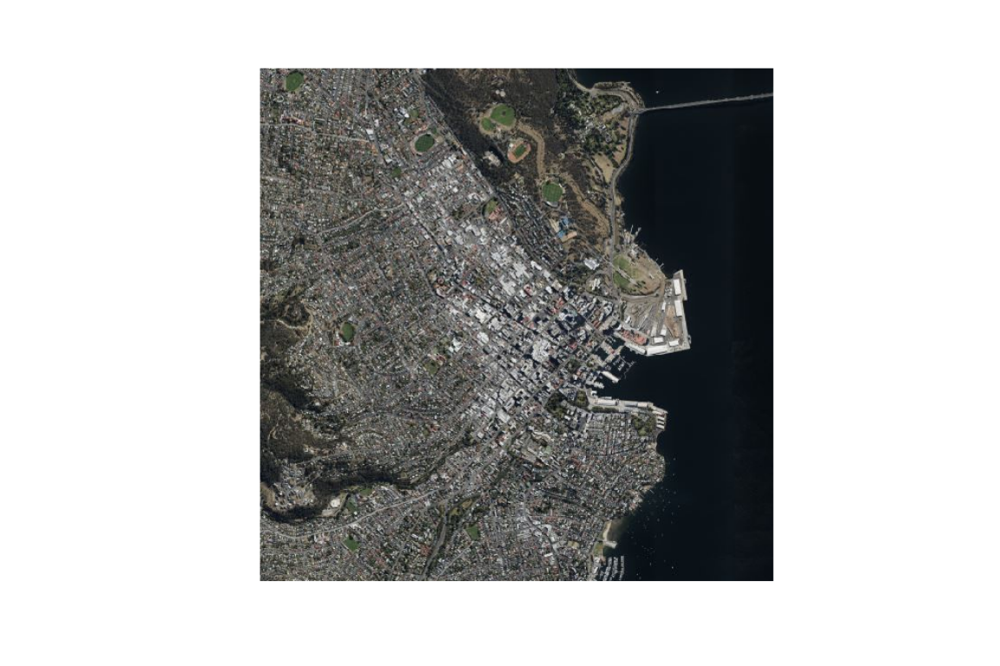
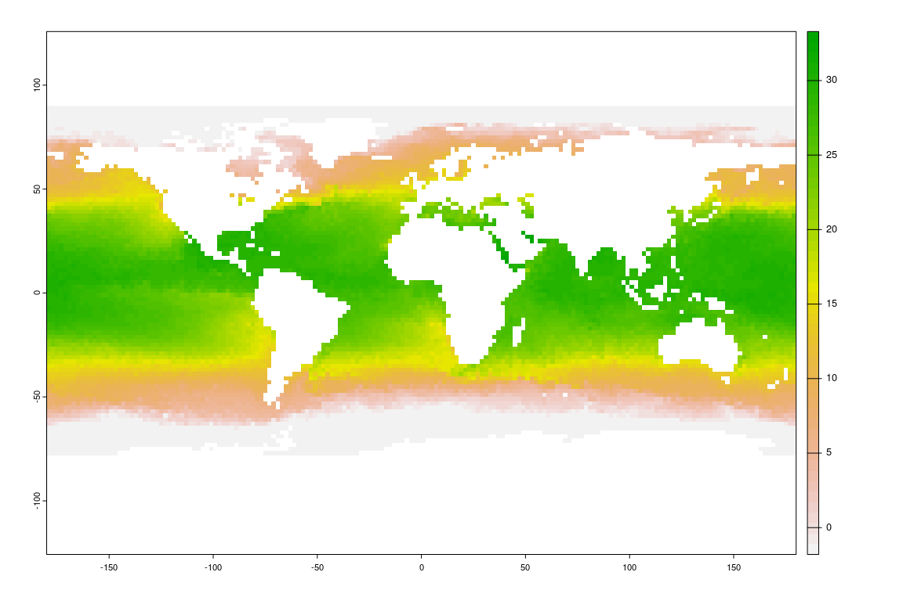
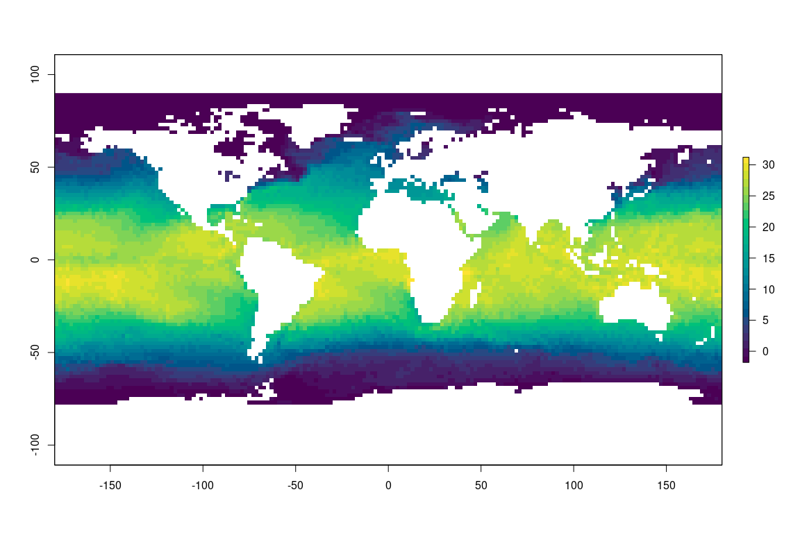
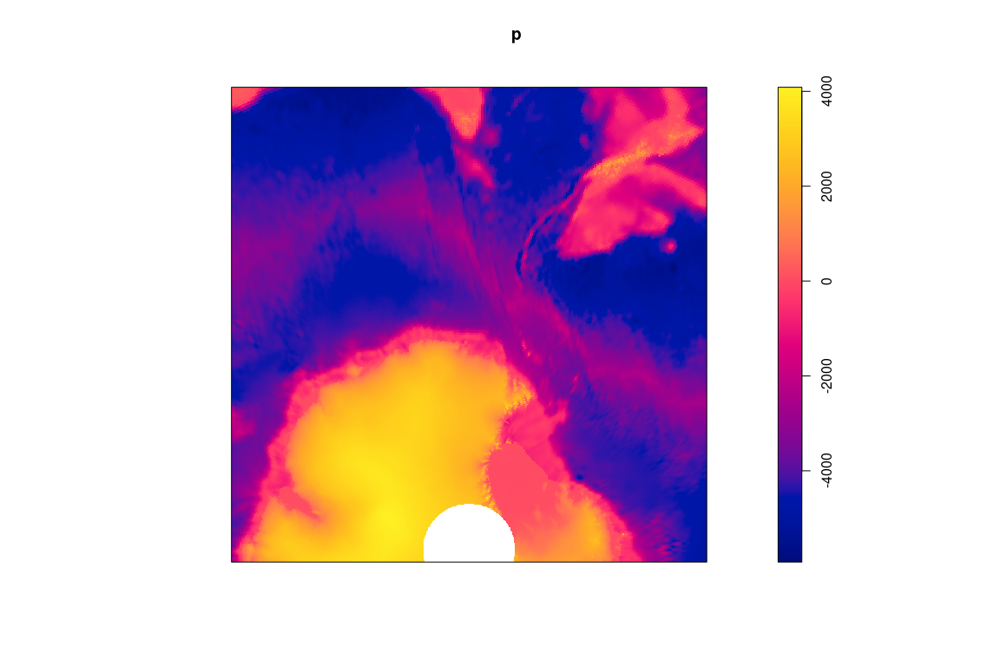

<!-- README.md is generated from README.Rmd. Please edit that file -->

# gdalio

<!-- badges: start -->
<!-- badges: end -->

The goal of gdalio is to read data direct with GDAL warp, with an
assumed grid specification.

We have these functions to easily read raster data via the GDAL warp
library:

-   `gdalio_data()` read data directly from a *data source name*
    i.e. file path, url, or database connection
-   `gdalio_set_default_grid()` specify a grid (extent, dimension,
    projection) to use for all subsequent operations
-   `gdalio_get_default_grid()` get the grid currently in use
-   `vrt()` simple function to *augment* data sources that have missing
    or incorrect *extent* or *projection* metadata

In this readme we illustrate the use of these from some online and local
raster data sources, and provide helpers for reading into particular
formats used in R (base matrix, raster package, stars package, spatstat
package, terra package).

TODO:

-   [ ] we need to be able to revert to the native grid of a source :)
-   [ ] be able to set a default grid for general use, or have helpers
    of them
-   [ ] do we automatically read all bands if not specified, or find the
    special cases 1, 2, 4?

## Installation

You can install gdalio from
[Github](https://github.com/hypertidy/gdalio) with:

``` r
#install.packages("remotes")
#install.packages("vapour)
remotes::install_github("hypertidy/gdalio")
```

## Example

At root, what we’re talking about is having a *target grid*, we nominate
it upfront and then any data we request from GDAL will *fill that grid*
by GDAL’s warp magic.

This works best for data you have access to locally, nice examples are
available but require a bit of prep. We have a sea surface temperature
data set, we need GDAL’s subdataset syntax for a file at a URL and
*augment* our file address with what we know is the projection of the
data.

``` r
library(gdalio)

## online data, daily ocean temperature surface product, one layer in longlat 0.25 degree res
f <- vrt("NETCDF:\"/vsicurl/https://www.ncei.noaa.gov/data/sea-surface-temperature-optimum-interpolation/v2.1/access/avhrr/198403/oisst-avhrr-v02r01.19840308.nc\":sst", 
         projection = "+proj=longlat +datum=WGS84")
```

Now, we can set up the grid for the window of data we want and start
reading.

``` r
## we set up a grid (this is a *raster* in abstraction)
grid0 <- list(extent = c(-1e6, 1e6, -5e5, 5e5 ), 
                             dimension = c(512, 256), 
                             projection = "+proj=laea +lon_0=147 +lat_0=-42")
gdalio_set_default_grid(grid0)
```

And now start reading data.

``` r
## then we get GDAL to get a value for every pixel in our grid
pix <- gdalio_data(f)  
## we have a list vector for each band (just one here)
plot(pix[[1]], pch = ".")
```


``` r
## those look a little simplified (it's because we are asking for quite high resolution from a low resolution source)
pix_interp <- gdalio_data(f, resample = "bilinear")  
## use resampling we get quite a different result
plot(pix_interp[[1]], pch = ".")
```


Normally of course we want a bit more convenience, and actually fill a
format in R or some package that has spatial types. So we define those
helpers here.

These equivalent functions format the data into objects used by various
packages.

``` r
## simple list format used by graphics::image() - we can only handle one band/layer
gdalio_base <- function(dsn, ...) {
   v <- gdalio_data(dsn, ...)
   g <- gdalio_get_default_grid()
   list(x = seq(g$extent[1], g$extent[2], length.out = g$dimension[1]), 
        y = seq(g$extent[3], g$extent[4], length.out = g$dimension[2]), 
        z = matrix(v[[1]], g$dimension[1])[, g$dimension[2]:1])
}
```

R for a long time had a powerful list(x,y,z) format for `image()`:

``` r
xyz <- gdalio_base(f)
image(xyz)
```



And now there are a bunch of other types for rasters.

``` r
## spatstat
gdalio_im <- function(dsn, ...) {
   v <- gdalio_data(dsn, ...)
   g <- gdalio_get_default_grid()
   ## can we have a list of im?
   if (length(v) > 1) message("only returning one image layer im, for now")
   m <- matrix(v[[1]], g$dimension[1])
   spatstat.geom::im(t(m[,ncol(m):1]), xrange = g$extent[1:2], yrange = g$extent[3:4])
}

## raster
gdalio_raster <- function(dsn, ...) {
   v <- gdalio_data(dsn, ...)
   g <- gdalio_get_default_grid()
   r <- raster::raster(raster::extent(g$extent), nrows = g$dimension[2], ncols = g$dimension[1], crs = g$projection)
   if (length(v) > 1) {
      r <- raster::brick(replicate(length(v), r, simplify = FALSE))
   }
   raster::setValues(r, matrix(unlist(v), prod(g$dimension)))
}

## terra
gdalio_terra <- function(dsn, ...) {
   v <- gdalio_data(dsn, ...)
   g <- gdalio_get_default_grid()
   r <- terra::rast(terra::ext(g$extent), nrows = g$dimension[2], ncols = g$dimension[1], crs = g$projection)
   if (length(v) > 1) terra::nlyr(r) <- length(v)
   terra::setValues(r, matrix(unlist(v), prod(g$dimension)))
}

## stars
gdalio_stars <- function(dsn, ...) {
   v <- gdalio_data(dsn, ...)
   g <- gdalio_get_default_grid()
   aa <- array(unlist(v), c(g$dimension[1], g$dimension[2], length(v)))#[,g$dimension[2]:1, , drop = FALSE]
   if (length(v) == 1) aa <- aa[,,1, drop = TRUE]
   r <- stars::st_as_stars(sf::st_bbox(c(xmin = g$extent[1], ymin = g$extent[3], xmax = g$extent[2], ymax = g$extent[4])),
                           nx = g$dimension[1], ny = g$dimension[2], values = aa)
   
   r <- sf::st_set_crs(r, g$projection)
   r
}

# graphics raster
gdalio_graphics <- function(dsn, ..., bands = 1:3) {
  hex <- gdalio_data_hex(dsn, bands = bands, ...)
  g <- gdalio_get_default_grid()
  grDevices::as.raster(t(matrix(hex, g$dimension[1])))
}
```

To prove the point we now read the same data but into our format of
choice. We are *re-reading* data here (it all exists in `pix` above, but
you get the idea).

``` r
op <- par(mfrow = c(2, 2))
#plot(matrix(g$extent, ncol = 2), type = "n", asp = 1, xlab = "x", ylab = "y", main = "stars")
image(gdalio_stars(f), main = "stars")
raster::plot(gdalio_raster(f), col = hcl.colors(26), main = "raster")
terra::plot(gdalio_terra(f), main = "terra")
plot(gdalio_im(f), main = "\nspatstat")
```



``` r
par(op)
```

In the same way, we can also use different methods of resampling and
easily see the effect.

``` r
op <- par(mfrow = c(2, 1))
image(gdalio_stars(f, resample = "cubicspline"), col = hcl.colors(26))
image(gdalio_stars(f, resample = "lanczos"), col = hcl.colors(26))
```



``` r
par(op)
```

## Imagery

This works as well for online image sources that present in photo form.

``` r
virtualearth_imagery <- tempfile(fileext = ".xml")
writeLines('<GDAL_WMS>
  <Service name="VirtualEarth">
    <ServerUrl>http://a${server_num}.ortho.tiles.virtualearth.net/tiles/a${quadkey}.jpeg?g=90</ServerUrl>
  </Service>
  <MaxConnections>4</MaxConnections>
  <Cache/>
</GDAL_WMS>', virtualearth_imagery)

img <- gdalio_raster(virtualearth_imagery, bands = 1:3)
raster::plotRGB(img)
```


``` r
## let's really zoom in on somewhere cool
grid1 <- list(extent = c(-1, 1, -1, 1) * 2e3,
                             dimension = c(512, 512), 
                             projection = "+proj=laea +lon_0=147.325 +lat_0=-42.880556")
gdalio_set_default_grid(grid1)
img <- gdalio_raster(virtualearth_imagery, bands = 1:3)
raster::plotRGB(img)
```


To obtain the raw data values we can use `gdalio_data_rgb()` or
`gdalio_data_hex()` without specifying the number of bands, but these
are a little experimental for now.

``` r
rgbvals <- gdalio_data_rgb(virtualearth_imagery)
hexvals <- gdalio_data_hex(virtualearth_imagery)
```

We can use this to drive R’s own raster type, the
`grDevices::as.raster()` array.

``` r
arr <- gdalio_graphics(virtualearth_imagery)
grid1 <- gdalio_get_default_grid()
plot(matrix(grid1$extent, 2), type = "n", asp = 1)
graphics::rasterImage(arr, grid1$extent[1], grid1$extent[3], grid1$extent[2], grid1$extent[4])
```


Using R itself we can `plot()` that but it must be transpose (and we
must use a different idiom for the extent).

*Don’t use plot.raster(xlim,ylim) they don’t what they claim to do, we
can only get sensible extents at R version 4.1.0 with `rasterImage()`.*

``` r
plot(t(arr))
```



``` r
par("usr")
#> [1] -191.1688  703.1688    0.0000  512.0000
```

## Default grid (there is one)

Say we don’t set a grid at all, just go a default.

``` r
gdalio_set_default_grid()

image(gdalio_stars(f))
```



``` r
raster::plot(gdalio_raster(f), col = hcl.colors(26))
```



``` r
terra::plot(gdalio_raster(f))
```


``` r
plot(gdalio_im(f))
```


Some sources, files in spData, image servers, etc.

``` r
elevation.tiles.prod <- tempfile(fileext = ".xml")
writeLines('<GDAL_WMS>
  <Service name="TMS">
    <ServerUrl>https://s3.amazonaws.com/elevation-tiles-prod/geotiff/${z}/${x}/${y}.tif</ServerUrl>
  </Service>
  <DataWindow>
    <UpperLeftX>-20037508.34</UpperLeftX>
    <UpperLeftY>20037508.34</UpperLeftY>
    <LowerRightX>20037508.34</LowerRightX>
    <LowerRightY>-20037508.34</LowerRightY>
    <TileLevel>14</TileLevel>
    <TileCountX>1</TileCountX>
    <TileCountY>1</TileCountY>
    <YOrigin>top</YOrigin>
  </DataWindow>
  <Projection>EPSG:3857</Projection>
  <BlockSizeX>512</BlockSizeX>
  <BlockSizeY>512</BlockSizeY>
  <BandsCount>1</BandsCount>
  <DataType>Int16</DataType>
  <ZeroBlockHttpCodes>403,404</ZeroBlockHttpCodes>
  <DataValues>
    <NoData>-32768</NoData>
  </DataValues>
  <Cache/>
</GDAL_WMS>', elevation.tiles.prod)

## we'll use this as a grid specification, not the actual data for anything
sfiles <- list.files(system.file("raster", package = "spDataLarge", mustWork = TRUE), full.names = TRUE)

## we don't take raster objects, just the spec: extent, dim, projection
ri <- vapour::vapour_raster_info(sfiles[1])

gdalio_set_default_grid(list(extent = affinity::gt_dim_to_extent(ri$geotransform, ri$dim), 
                             dimension = ri$dimXY, 
                             projection = ri$projection))
s <- gdalio_stars(elevation.tiles.prod)
library(stars); plot(s)
#> Loading required package: abind
#> Loading required package: sf
#> Linking to GEOS 3.9.0, GDAL 3.2.1, PROJ 7.2.1
#> downsample set to c(1,1)
```


``` r

## we can do this anywhere, in any projection but it depends on what our source *has* of course
## but, it's pretty general and powerful
gdalio_set_default_grid(list(extent = c(-1, 1, -1, 1) * 3e6, 
                             dimension = c(768, 813), 
                             projection = "+proj=stere +lat_0=-65 +lon_0=147"))
p <- gdalio_im(elevation.tiles.prod)
plot(p)
```



My favourite projection family (I think) is Oblique Mercator. For a long
time I’ve wanted this kind of freedom and convenience for working with
spatial data … rather than constantly juggling objects and formats and
plumbing, more to come. :)

``` r
omerc <- "+proj=omerc +lonc=147 +gamma=9 +alpha=9 +lat_0=-10 +ellps=WGS84"

gdalio_set_default_grid(list(extent = c(-1, 1, -1, 1) * 7e6, 
                             dimension = c(768, 813), 
                             projection = omerc))

o <- gdalio_raster(elevation.tiles.prod)
#> Warning in showSRID(uprojargs, format = "PROJ", multiline = "NO", prefer_proj
#> = prefer_proj): Discarded datum Unknown based on WGS84 ellipsoid in Proj4
#> definition
raster::plot(o, col = hcl.colors(52))
xy <- reproj::reproj(raster::coordinates(o), "+proj=longlat", source = raster::projection(o))
xy[xy[,1] < 0, 1] <- xy[xy[,1] < 0, 1] + 360
library(raster)
#> Loading required package: sp
contour(raster::setValues(o, xy[,1]), add = TRUE, col = "white")
contour(setValues(o, xy[,2]), add = TRUE, col = "white")
```


The fun part is I can now change the source, I’ve already set up the map
I want and I can simply ask for a new set of pixels. The topography data
happens to be in Mercator from a tiled and level of detail image
service, while the SST is from a model output format (NetCDF) at a
single resolution. GDAL doesn’t care! Let’s make them the same:

``` r
sst <- gdalio_raster(f)
#> Warning in showSRID(uprojargs, format = "PROJ", multiline = "NO", prefer_proj
#> = prefer_proj): Discarded datum Unknown based on WGS84 ellipsoid in Proj4
#> definition
raster::plot(sst, col = palr::sst_pal(26))
contour(setValues(o, xy[,1]), add = TRUE, col = "white")
contour(setValues(o, xy[,2]), add = TRUE, col = "white")
contour(o, add = TRUE, labels = "", col = "black", levels = seq(0, 4500, by = 500))
```


## Code of Conduct

Please note that the gdalio project is released with a [Contributor Code
of
Conduct](https://contributor-covenant.org/version/2/0/CODE_OF_CONDUCT.html).
By contributing to this project, you agree to abide by its terms.
