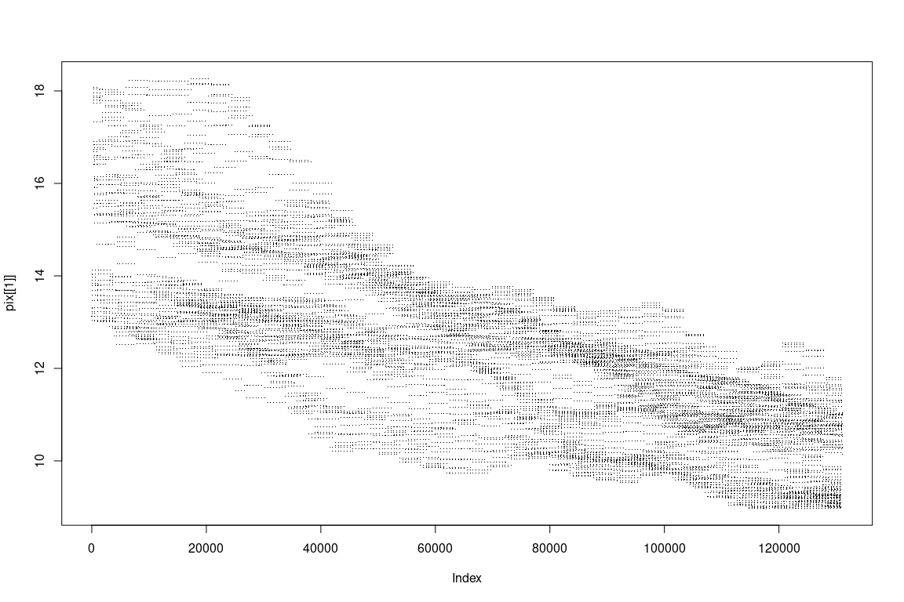
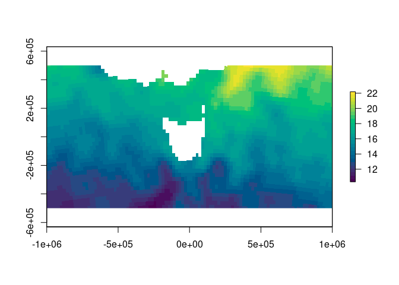

<!-- README.md is generated from README.Rmd. Please edit that file -->

# gdalio

<!-- badges: start -->
<!-- badges: end -->

The goal of gdalio is to read data direct with GDAL warp, with an
assumed grid specification.

## Installation

You can install the released version of gdalio from
[CRAN](https://CRAN.R-project.org) with:

``` r
install.packages("gdalio")
```

## Example

At root, what we’re talking about is having a *target grid*, we nominate
it upfront and then any data we request from GDAL will *fill that grid*
by GDAL’s warp magic.

So

``` r
library(gdalio)
## we set up a grid (this is a *raster* in abstraction)
gdalio_set_default_grid(list(extent = c(-1e6, 1e6, -5e5, 5e5 ), 
                             dimension = c(1018, 512), 
                             projection = "+proj=laea +lon_0=147 +lat_0=-42"))

## this data's available online, it's a daily ocean temperature surface product, this is one layer in longlat for the entire globe at 0.25 degree res
f <- "NETCDF:\"/vsicurl/https://www.ncei.noaa.gov/data/sea-surface-temperature-optimum-interpolation/v2.1/access/avhrr/198403/oisst-avhrr-v02r01.19840308.nc\":sst"

## then we get GDAL to get a value for every pixel in our grid
pix <- gdalio_data(f, source_wkt = "+proj=longlat")  ## source doesn't know its crs, so we have to add here (WIP)

## we have a list vector for each band (just one here)
plot(pix[[1]], pch = ".")
```



Normally of course we want a bit more convenience, and actually fill a
format in R or some package that has spatial types. So we define those
helpers here.

These equivalent functions format the data into objects used by various
packages.

``` r
## simple list format used by graphics::image() - we can only handle one band/layer
gdalio_base <- function(dsn, ...) {
   v <- gdalio_data(dsn, ...)
   g <- gdalio_get_default_grid()
   list(x = seq(g$extent[1], g$extent[2], length.out = g$dimension[1]), 
        y = seq(g$extent[3], g$extent[4], length.out = g$dimension[2]), 
        z = matrix(v[[1]], g$dimension[1])[, g$dimension[2]:1])
}
```

R for a long time had a powerful list(x,y,z) format for `image()`:

``` r
xyz <- gdalio_base(f, source_wkt = "+proj=longlat")
image(xyz)
```


And now a bunch of other types also exist.

``` r
## spatstat
gdalio_im <- function(dsn, ...) {
   v <- gdalio_data(dsn, ...)
   g <- gdalio_get_default_grid()
   ## can we have a list of im?
   if (length(v) > 1) message("only returning one image layer im, for now")
   m <- matrix(v[[1]], g$dimension[1])
   spatstat.geom::im(t(m[,ncol(m):1]), xrange = g$extent[1:2], yrange = g$extent[3:4])
}

## raster
gdalio_raster <- function(dsn, ...) {
   v <- gdalio_data(dsn, ...)
   g <- gdalio_get_default_grid()
   r <- raster::raster(raster::extent(g$extent), nrows = g$dimension[2], ncols = g$dimension[1], crs = g$projection)
   if (length(v) > 1) {
      r <- raster::brick(replicate(length(v), r, simplify = FALSE))
   }
   raster::setValues(r, matrix(unlist(v), prod(g$dimension)))
}

## terra

gdalio_terra <- function(dsn, ...) {
   v <- gdalio_data(dsn, ...)
   g <- gdalio_get_default_grid()
   r <- terra::rast(terra::ext(g$extent), nrows = g$dimension[2], ncols = g$dimension[1], crs = g$projection)
   if (length(v) > 1) terra::nlyr(r) <- length(v)
   terra::setValues(r, matrix(unlist(v), prod(g$dimension)))
}

## stars

gdalio_stars <- function(dsn, ...) {
   v <- gdalio_data(dsn, ...)
   g <- gdalio_get_default_grid()
   aa <- array(unlist(v), c(g$dimension[1], g$dimension[2], length(v)))#[,g$dimension[2]:1, , drop = FALSE]
   if (length(v) == 1) aa <- aa[,,1, drop = TRUE]
   r <- stars::st_as_stars(sf::st_bbox(c(xmin = g$extent[1], ymin = g$extent[3], xmax = g$extent[2], ymax = g$extent[4])),
                           nx = g$dimension[1], ny = g$dimension[2], values = aa)
   
   r <- sf::st_set_crs(r, g$projection)
   r
}
```

``` r
library(gdalio)


gdalio_set_default_grid(list(extent = c(-1e6, 1e6, -5e5, 5e5 ), dimension = c(1018, 512), projection = "+proj=laea +lon_0=147 +lat_0=-42"))
f <- "NETCDF:\"/vsicurl/https://www.ncei.noaa.gov/data/sea-surface-temperature-optimum-interpolation/v2.1/access/avhrr/198403/oisst-avhrr-v02r01.19840308.nc\":sst"

## this source doesn't know its projection so we augment by passing that in
plot(gdalio_stars(f, source_wkt = "+proj=longlat"))
#> downsample set to c(1,1)
```


``` r
raster::plot(gdalio_raster(f, source_wkt = "+proj=longlat"), col = hcl.colors(26))
```



``` r
terra::plot(gdalio_raster(f, source_wkt = "+proj=longlat"))
```


``` r
plot(gdalio_im(f, source_wkt = "+proj=longlat"))
```


Say we don’t set a grid at all, just go with default. We can’t help that
OISST is 0,360 but that’s irrelevant.

``` r
gdalio_set_default_grid()
f <- "NETCDF:\"/vsicurl/https://www.ncei.noaa.gov/data/sea-surface-temperature-optimum-interpolation/v2.1/access/avhrr/198403/oisst-avhrr-v02r01.19840308.nc\":sst"
plot(gdalio_stars(f, source_wkt = "+proj=longlat"))
```


``` r
raster::plot(gdalio_raster(f, source_wkt = "+proj=longlat"), col = hcl.colors(26))
```


``` r
terra::plot(gdalio_raster(f, source_wkt = "+proj=longlat"))
```


``` r
plot(gdalio_im(f, source_wkt = "+proj=longlat"))
```


Some sources, files in spData, image servers, etc.

``` r
elevation.tiles.prod <- tempfile(fileext = ".xml")
writeLines('<GDAL_WMS>
  <Service name="TMS">
    <ServerUrl>https://s3.amazonaws.com/elevation-tiles-prod/geotiff/${z}/${x}/${y}.tif</ServerUrl>
  </Service>
  <DataWindow>
    <UpperLeftX>-20037508.34</UpperLeftX>
    <UpperLeftY>20037508.34</UpperLeftY>
    <LowerRightX>20037508.34</LowerRightX>
    <LowerRightY>-20037508.34</LowerRightY>
    <TileLevel>14</TileLevel>
    <TileCountX>1</TileCountX>
    <TileCountY>1</TileCountY>
    <YOrigin>top</YOrigin>
  </DataWindow>
  <Projection>EPSG:3857</Projection>
  <BlockSizeX>512</BlockSizeX>
  <BlockSizeY>512</BlockSizeY>
  <BandsCount>1</BandsCount>
  <DataType>Int16</DataType>
  <ZeroBlockHttpCodes>403,404</ZeroBlockHttpCodes>
  <DataValues>
    <NoData>-32768</NoData>
  </DataValues>
  <Cache/>
</GDAL_WMS>', elevation.tiles.prod)

## we'll use this as a grid specification, not the actual data for anything
sfiles <- list.files(system.file("raster", package = "spDataLarge", mustWork = TRUE), full.names = TRUE)

## we don't take raster objects, just the spec: extent, dim, projection
ri <- vapour::vapour_raster_info(sfiles[1])

gdalio_set_default_grid(list(extent = affinity::gt_dim_to_extent(ri$geotransform, ri$dim), 
                             dimension = ri$dimXY, 
                             projection = ri$projection))
s <- gdalio_stars(elevation.tiles.prod)
library(stars); plot(s)
#> Loading required package: abind
#> Loading required package: sf
#> Linking to GEOS 3.9.0, GDAL 3.2.1, PROJ 7.2.1
#> downsample set to c(2,2)
```


``` r

## we can do this anywhere, in any projection but it depends on what our source *has* of course
## but, it's pretty general and powerful
gdalio_set_default_grid(list(extent = c(-1, 1, -1, 1) * 3e6, 
                             dimension = c(768, 813), 
                             projection = "+proj=stere +lat_0=-65 +lon_0=147"))
p <- gdalio_im(elevation.tiles.prod)
plot(p)
```


My favourite projection family (I think) is Oblique Mercator. For a long
time I’ve wanted this kind of freedom and convenience for working with
spatial data … rather than constantly juggling objects and formats and
plumbing, more to come. :)

``` r
omerc <- "+proj=omerc +lonc=147 +gamma=9 +alpha=9 +lat_0=-10 +ellps=WGS84"

gdalio_set_default_grid(list(extent = c(-1, 1, -1, 1) * 7e6, 
                             dimension = c(768, 813), 
                             projection = omerc))

o <- gdalio_raster(elevation.tiles.prod)
#> Warning in showSRID(uprojargs, format = "PROJ", multiline = "NO", prefer_proj
#> = prefer_proj): Discarded datum Unknown based on WGS84 ellipsoid in Proj4
#> definition
raster::plot(o, col = hcl.colors(52))
xy <- reproj::reproj(raster::coordinates(o), "+proj=longlat", source = raster::projection(o))
xy[xy[,1] < 0, 1] <- xy[xy[,1] < 0, 1] + 360
library(raster)
#> Loading required package: sp
contour(raster::setValues(o, xy[,1]), add = TRUE, col = "white")
contour(setValues(o, xy[,2]), add = TRUE, col = "white")
```


## Code of Conduct

Please note that the gdalio project is released with a [Contributor Code
of
Conduct](https://contributor-covenant.org/version/2/0/CODE_OF_CONDUCT.html).
By contributing to this project, you agree to abide by its terms.
